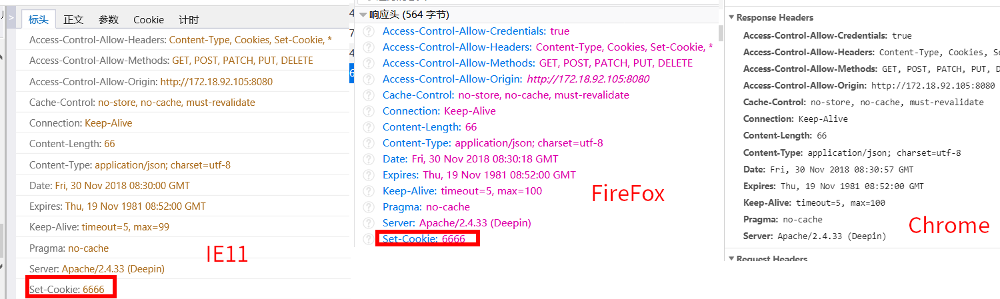
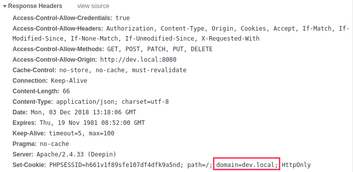
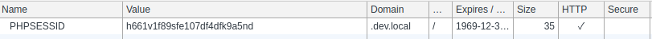
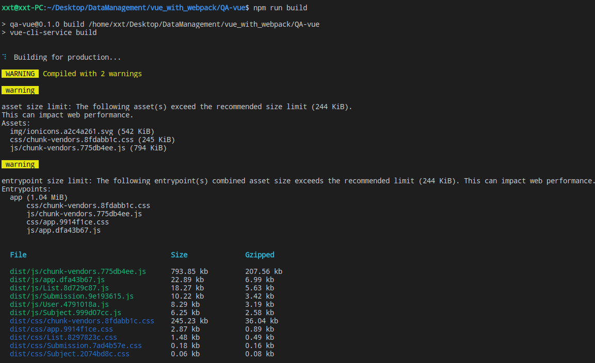

Vue/iViewUI问答系统
===
该问答数据管理系统的后台项目地址，请点[这里](https://github.com/XuXianTao/QA-management-back-end)
---

# 部署
该项目已默认配置url的基础路径为`/qa`
【可以在`vue.config.js`中修改`baseUrl`的生产环境下基础路径配置，同时对于后台接口api地址的配置可以在`/src/apis/_base.js`中对生产环境基础路径进行修改】
因此需要部署到服务器目录下的`/qa`目录
1. 通过`npm install` 安装依赖
2. 通过`npm run build`编译生成生产环境代码到`/dist`
3. 以apache服务器为例，为`/dist`建立软链接到`/var/www/html/qa`
4. 之后在进行后台项目的部署

# 文件目录说明
~~~
|-- qa_vue
    |-- .eslintrc                            编辑器语法提示配置
    |-- .gitignore                           git仓库忽视目录配置
    |-- README.md                            说明文档
    |-- babel.config.js                      babel[es6转es5]配置
    |-- package-lock.json                    依赖版本控制
    |-- package.json                         项目依赖
    |-- vue.config.js                        vue-cli下的webpack与其他配置
    |-- webpack.output.js                    通过`vue inspect >> webpack.output.js`输出的配置
    |-- dist                                 生产环境下的打包后的项目文件
    |-- img                                  文档所用的截图
    |-- public                               
    |   |-- favicon.ico                      入口图标
    |   |-- index.html                       入口html文件
    |-- src
        |-- App.vue                          vue入口文件
        |-- main.js                          webpack入口js文件
        |-- apis                             api接口请求封装
        |   |-- _base.js
        |   |-- answer.js
        |   |-- collection.js
        |   |-- index.js
        |   |-- question.js
        |   |-- subject.js
        |   |-- submission.js
        |   |-- user.js
        |-- assets                           站点所用到的资源文件
        |   |-- iviewicon.png
        |   |-- logo.png
        |-- components                       vue组件
        |   |-- ListDrawer.vue
        |   |-- SelectAnswer.vue
        |   |-- SelectSubject.vue
        |-- libs                             公用函数库
        |   |-- index.js
        |   |-- lib.js
        |   |-- updateTable.js
        |   |-- ws.js
        |-- router                           vue-router路由配置
        |   |-- app.js
        |-- store                            vuex状态管理共享变量
        |   |-- index.js
        |-- views                            具体的视图vue文件
            |-- Main.vue                     管理主页面布局
            |-- UserLogin.vue                用户登录界面
            |-- Main
                |-- List.vue                 管理界面下的语料管理界面
                |-- Subject.vue              管理界面下的科目管理界面
                |-- Submission.vue           管理界面下的提交数据的管理界面
                |-- User.vue                 管理界面下的用户管理界面
~~~


----
# 问题记录

## 前后端跨域
对于前后端分离，存在跨域问题，在不同浏览器下的同源策略有所不同，是需要解决的重点问题
  - 首先为了实现跨域，在接口的返回头部信息中需要加上`Access-Control-Allow-*`的头部信息，而且对于cookie的内容使用需要`Access-Control-Allow-Credentials`头部设置为`true`并且`Access-Control-Allow-Origin`要求设置为具体的域名而不能用`*`泛指，同时在前端`ajax请求`的时候需要设置`credentials: true`以实现cookie的跨域
  
  - 在本地局域网环境下的Set-Cookie字段在Chrome浏览器下是不支持的(也就是对于请求报文的Origin字段有所要求，不能是局域网的ip段也不能是localhost，所以可以通过修改本地访问的host映射实现set-cookie字段的获取)[参考资料](https://stackoverflow.com/questions/49065174/why-does-chrome-ignore-set-cookie-header)
  

  - 于是修改了本地hosts文件(linux环境下的路径为`/etc/hosts`)添加了localhost以外的地址指向本地Ip后即可[参考](https://stackoverflow.com/questions/8134384/chrome-doesnt-create-cookie-for-domain-localhost-in-broken-https)
  .png)

  - 对于set-cookie字段的domain配置，为了生效，不能设置为`http://dev.local:8080`这样的完整形式，而应该修改为`dev.local`这样的形式
  

  配置成功后结果如下
  

  **为了方便开发和生产环境的使用,在接口返回的Access-Control-Allow-Origin和Set-Cookie的domain信息都是根据请求报文头部的origin动态设置的**

## 路由配置
- 页面路径导航的多级嵌套的逻辑解耦
  - [参考](https://blog.csdn.net/qq_33594380/article/details/79979810)

## 接口解耦封装并实现自动化具名exports导出
由于传统es6不支持在语句内部进行export,需要Commonjs的导入形式支持
为了支持`exports`的动态变量模块导出形式，需要在babel配置中启用commonjs相关模块
采用babel的commonjs进行exports语句内部导出支持，同时使用webpack自带的require.context读取文件夹内所有文件，两者配合实现每次新建一个api接口文件都自动生成一个具名export导出
具体实现看`/src/apis/index.js`，由于webpack的解析首要目标为`index.js`所以导入形式可以`import {subject, user} from '@/apis'`直接导入文件夹即是导入index文件
  - 需要在`babel.config.js`配置文件中添加`"plugins": ["@babel/plugin-transform-modules-commonjs"]`

## 关于优化尝试
由于引入`iView`的第三方组件模块，导致js文件体积过大，尝试按照官方文档说明使用按需引入的方式缩减体积。由于使用组件较多，个人代码如下
```
const iViewComponent = ['Button','Form', 'FormItem', 'Input', 'Select', 'Layout', 'Message',
'Modal', 'Table', 'Sider', 'Menu', 'MenuItem', 'Icon', 'Upload', 'Row', 'Page', 'Drawer', 'Alert',
'Header', 'Content', 'Option']
const shouldUsed = ['Message']
iViewComponent.forEach(item => {
  let component_name = item.replace(/(?<=\S{1})[A-Z]/, '-$&').toLowerCase()
  let component = require('iview/src/components/' + component_name);
  Vue.component(item, component.default)
  if (shouldUsed.includes(item)) Vue.prototype['$' + item] = component.default
})
```
实际结果并不理想，使用按需引入后主要js文件`769kb`，压缩后`217kb`

而直接引入整个`iView`的主要js文件`793kb`,压缩后`207kb`

整体结果的体积变化差别不大，所以依旧还是使用原先的整个`iView`导入

## 关于上传文件后台处理的进度显示
想到的候选方案：
- 开始的时候想到使用两个接口-`上传接口`、`进度查询`，通过修改session来实现对同一个客户端的进度反馈，
  但是后来想到这样需要前端轮询发起请求，在后台处理文件的时候无疑会很有压力。
- 又想到可以通过在请求处理过程中建立ws-client来连接到server端进行进度的转发，
  但是这样就多出了额外的IO消耗（也想到用socket进程间通信，但是一样会有IO导致的消耗）

  最后在同学提醒下使用了**消息队列**的方式来实现方案！

## 关于组件继承的实现
- 由于项目内部存在多个表格，为了降低维护成本，将各个表格的vue文件抽取出相同的逻辑与视图层，降低代码量。
  
  遇到的问题：
    1. **逻辑层面的继承**: 即数据与内部函数的共享与继承
       解决方案：使用`extends`字段进行基础组件的继承，会自动继承包含视图、数据、函数在内的属性
    2. **视图层面的扩展**: 由于使用了`extends`字段进行继承，所以新的组件的`<template>`不能再进行单独的编写，也无法使用`slot`(调用子组件才能插入对应html) `子组件调用`(无法触发重新定义的内部函数)
       解决方案：在基础组件内使用动态组件标签并配合字段实现额外的组件插入
       ```
       // 基础组件声明额外的动态组件
       <component v-for="item in Object.entries(extra_components)" :key="item[0]" :is="item[1].instance" v-bind="item[1].props" v-on="item[1].events"></component>

       // data对应字段（可以为空）
        extra_components: {
          DrawerList: {
            instance: DrawerList,
            props: {
              that: this,
              get aid() { return this.that.aid_show }
            },
            events: {
              'change-show': this.handleChangeDrawerShow
            }
          }
        }
       ```

## 聊天室技术难点
- **textarea 自适应高度**
  对用户的输入操作`oninput`进行监听，让`style.height`与`scrollHeight`始终保持一致，同时为了在减小高度的时候有效，需要将`style.height`先置为`auto`让`scrollHeight`变成我们所需的正常高度而不是减小高度之前的`scrollHeight`
  ```
    el_input.oninput = () => {
      el_input.style.height = 'auto'
      el_input.scrollTop = 0
      el_input.style.height = el_input.scrollHeight + 'px'
      this.$emit('statu-change')
    }
  ```  

- **移动端滚动置底**
  为了实现良好聊天体验，需要让对话列表一直处于最底部，方便用户查看最新的对话信息
  - 监听手机软键盘
    由于js没有对于手机软键盘监听的API，所以另外通过`window.onresize`进行聊天列表的置底
  - 监听输入，当用户输入多行数据的时候，textarea会自适应变化高度，需要相应的滚动对话列表